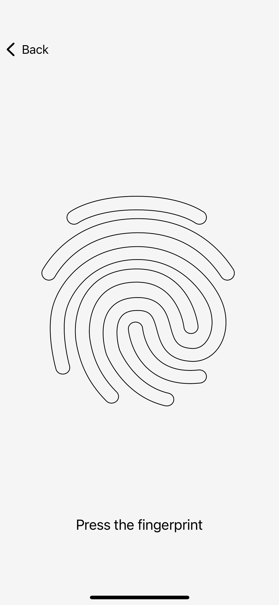
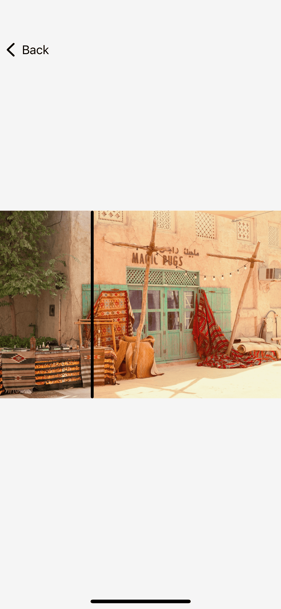
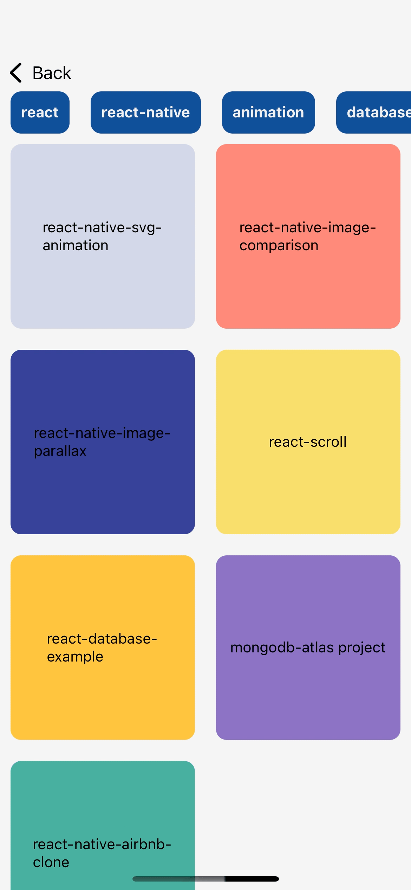
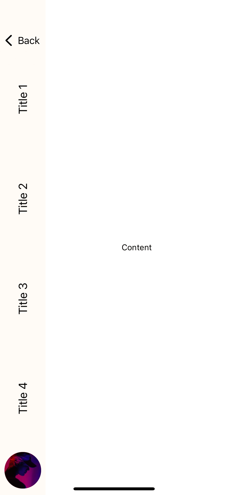

<h1 align="center">Welcome to my React-native sandbox 👋</h1>

  

I'll put all my React-native tests here

---

## Try it with [Expo Go App](https://expo.dev/client) :

 

    

---

## Overview

 

### Chanel animation

Rework of chanel scroll animation

    

 

### SVG animation

Press and hold to trigger the fingerprint animation

    

 

### Image parallax

Can't use Reanimated because of image flickering on IOS

    

 

### Images comparator

Move the selector to see differences between images

    

 

### Layout Animation

Try the new layout animation of Reanimated

    

 

### Vertical List

Simple view with vertical menu

    

